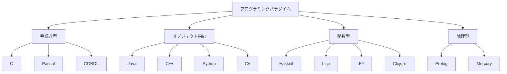
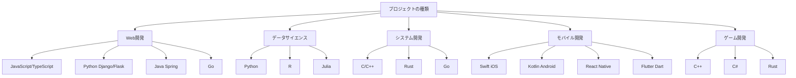

# 付録B: プログラミング言語比較

この付録では、主要なプログラミング言語の特徴、用途、パフォーマンスを比較します。

## B.1 言語分類と特徴

### B.1.1 コンパイル型 vs インタープリター型

| 言語 | 種類 | 実行速度 | 開発速度 | 主な用途 |
|------|------|----------|----------|----------|
| C/C++ | コンパイル型 | ⭐⭐⭐⭐⭐ | ⭐⭐ | システム開発、ゲーム |
| Rust | コンパイル型 | ⭐⭐⭐⭐⭐ | ⭐⭐⭐ | システム開発、Web |
| Go | コンパイル型 | ⭐⭐⭐⭐ | ⭐⭐⭐⭐ | サーバーサイド、CLI |
| Python | インタープリター | ⭐⭐ | ⭐⭐⭐⭐⭐ | データ分析、AI/ML |
| JavaScript | インタープリター | ⭐⭐⭐ | ⭐⭐⭐⭐ | Web開発、フロントエンド |
| Java | 中間コード | ⭐⭐⭐⭐ | ⭐⭐⭐ | エンタープライズ |

### B.1.2 パラダイム別分類



## B.2 詳細比較

### B.2.1 Python

**特徴:**
- 読みやすい構文
- 豊富なライブラリエコシステム
- 動的型付け
- インタープリター言語

**使用例:**

```python
# データ分析の例
import pandas as pd
import matplotlib.pyplot as plt

# CSVファイルの読み込み
data = pd.read_csv('sales_data.csv')

# 基本統計
print(data.describe())

# 可視化
plt.figure(figsize=(10, 6))
plt.plot(data['date'], data['sales'])
plt.title('Sales Trend')
plt.xlabel('Date')
plt.ylabel('Sales')
plt.show()

# 機械学習の例
from sklearn.linear_model import LinearRegression
from sklearn.model_selection import train_test_split

X = data[['advertising', 'price']]
y = data['sales']

X_train, X_test, y_train, y_test = train_test_split(X, y, test_size=0.2)
model = LinearRegression()
model.fit(X_train, y_train)

print(f"R² Score: {model.score(X_test, y_test):.3f}")
```

**パフォーマンス:** ⭐⭐  
**学習コスト:** ⭐⭐⭐⭐⭐  
**ライブラリ:** ⭐⭐⭐⭐⭐  

### B.2.2 JavaScript

**特徴:**
- ブラウザ標準言語
- 非同期プログラミング
- プロトタイプベースOOP
- 動的型付け

**使用例:**

```javascript
// フロントエンド（React）
import React, { useState, useEffect } from 'react';

const UserDashboard = () => {
    const [users, setUsers] = useState([]);
    const [loading, setLoading] = useState(true);

    useEffect(() => {
        fetchUsers();
    }, []);

    const fetchUsers = async () => {
        try {
            const response = await fetch('/api/users');
            const userData = await response.json();
            setUsers(userData);
        } catch (error) {
            console.error('Error fetching users:', error);
        } finally {
            setLoading(false);
        }
    };

    return (
        <div>
            <h1>User Dashboard</h1>
            {loading ? (
                <p>Loading...</p>
            ) : (
                <ul>
                    {users.map(user => (
                        <li key={user.id}>{user.name}</li>
                    ))}
                </ul>
            )}
        </div>
    );
};

// バックエンド（Node.js）
const express = require('express');
const app = express();

app.get('/api/users', async (req, res) => {
    try {
        const users = await User.findAll();
        res.json(users);
    } catch (error) {
        res.status(500).json({ error: error.message });
    }
});

app.listen(3000, () => {
    console.log('Server running on port 3000');
});
```

**パフォーマンス:** ⭐⭐⭐  
**学習コスト:** ⭐⭐⭐⭐  
**エコシステム:** ⭐⭐⭐⭐⭐  

### B.2.3 Java

**特徴:**
- "Write Once, Run Anywhere"
- 強い型システム
- 自動メモリ管理
- オブジェクト指向

**使用例:**

```java
// Spring Bootでのウェブアプリケーション
@SpringBootApplication
public class UserApplication {
    public static void main(String[] args) {
        SpringApplication.run(UserApplication.class, args);
    }
}

@RestController
@RequestMapping("/api/users")
public class UserController {
    
    @Autowired
    private UserService userService;
    
    @GetMapping
    public ResponseEntity<List<User>> getAllUsers() {
        List<User> users = userService.findAll();
        return ResponseEntity.ok(users);
    }
    
    @PostMapping
    public ResponseEntity<User> createUser(@RequestBody @Valid User user) {
        User savedUser = userService.save(user);
        return ResponseEntity.status(HttpStatus.CREATED).body(savedUser);
    }
}

@Entity
@Table(name = "users")
public class User {
    @Id
    @GeneratedValue(strategy = GenerationType.IDENTITY)
    private Long id;
    
    @Column(nullable = false)
    private String name;
    
    @Column(unique = true)
    private String email;
    
    // コンストラクタ、ゲッター、セッター
    public User() {}
    
    public User(String name, String email) {
        this.name = name;
        this.email = email;
    }
    
    // ゲッター・セッター省略
}
```

**パフォーマンス:** ⭐⭐⭐⭐  
**学習コスト:** ⭐⭐⭐  
**エンタープライズ適用:** ⭐⭐⭐⭐⭐  

### B.2.4 Rust

**特徴:**
- メモリ安全性
- ゼロコスト抽象化
- 所有権システム
- 高パフォーマンス

**使用例:**

```rust
// ウェブサーバー（Actix-web）
use actix_web::{web, App, HttpResponse, HttpServer, Result};
use serde::{Deserialize, Serialize};

#[derive(Serialize, Deserialize)]
struct User {
    id: u32,
    name: String,
    email: String,
}

async fn get_users() -> Result<HttpResponse> {
    let users = vec![
        User {
            id: 1,
            name: "Alice".to_string(),
            email: "alice@example.com".to_string(),
        },
        User {
            id: 2,
            name: "Bob".to_string(),
            email: "bob@example.com".to_string(),
        },
    ];
    
    Ok(HttpResponse::Ok().json(users))
}

async fn create_user(user: web::Json<User>) -> Result<HttpResponse> {
    println!("Creating user: {:?}", user);
    Ok(HttpResponse::Created().json(&*user))
}

#[actix_web::main]
async fn main() -> std::io::Result<()> {
    HttpServer::new(|| {
        App::new()
            .route("/api/users", web::get().to(get_users))
            .route("/api/users", web::post().to(create_user))
    })
    .bind("127.0.0.1:8080")?
    .run()
    .await
}

// システムプログラミング例
use std::fs::File;
use std::io::{BufRead, BufReader, Result};

fn count_lines(filename: &str) -> Result<usize> {
    let file = File::open(filename)?;
    let reader = BufReader::new(file);
    Ok(reader.lines().count())
}

fn main() -> Result<()> {
    match count_lines("example.txt") {
        Ok(lines) => println!("ファイルの行数: {}", lines),
        Err(e) => eprintln!("エラー: {}", e),
    }
    Ok(())
}
```

**パフォーマンス:** ⭐⭐⭐⭐⭐  
**学習コスト:** ⭐⭐  
**メモリ安全性:** ⭐⭐⭐⭐⭐  

## B.3 パフォーマンス比較

### B.3.1 ベンチマーク結果

```python
# ベンチマーク: フィボナッチ数列（n=40）
# 実行時間の比較

languages = ['C', 'Rust', 'Go', 'Java', 'JavaScript', 'Python']
execution_times = [0.5, 0.6, 1.2, 2.1, 3.8, 45.2]  # 秒

import matplotlib.pyplot as plt

plt.figure(figsize=(12, 6))
bars = plt.bar(languages, execution_times, color=['#ff6b6b', '#4ecdc4', '#45b7d1', '#f39c12', '#f1c40f', '#9b59b6'])
plt.ylabel('実行時間（秒）')
plt.title('フィボナッチ数列（n=40）の実行時間比較')
plt.yscale('log')  # 対数スケール

# 各バーに値を表示
for bar, time in zip(bars, execution_times):
    plt.text(bar.get_x() + bar.get_width()/2, bar.get_height(),
             f'{time}s', ha='center', va='bottom')

plt.show()
```

### B.3.2 メモリ使用量

| 言語 | 基本使用量 | 大規模アプリ | 特徴 |
|------|-----------|-------------|------|
| C | 最小限 | 完全制御 | 手動管理 |
| Rust | 低い | 予測可能 | 所有権システム |
| Go | 低い | 効率的GC | ガベージコレクション |
| Java | 中程度 | JVMヒープ | 自動メモリ管理 |
| JavaScript | 中程度 | V8最適化 | 動的最適化 |
| Python | 高い | オブジェクト豊富 | 参照カウント+GC |

## B.4 エコシステムと学習リソース

### B.4.1 パッケージ管理

```bash
# Python - pip
pip install requests numpy pandas
pip freeze > requirements.txt
pip install -r requirements.txt

# JavaScript - npm
npm install express react axios
npm init
npm install --save-dev jest

# Java - Maven
# pom.xml
<dependencies>
    <dependency>
        <groupId>org.springframework</groupId>
        <artifactId>spring-boot-starter-web</artifactId>
        <version>2.7.0</version>
    </dependency>
</dependencies>

# Rust - Cargo
cargo new my_project
cargo add serde tokio
cargo build
cargo run

# Go - go mod
go mod init myproject
go get github.com/gorilla/mux
go run main.go
```

### B.4.2 開発環境

| 言語 | 推奨IDE/エディタ | デバッガー | テストフレームワーク |
|------|-----------------|-----------|---------------------|
| Python | PyCharm, VSCode | pdb, debugpy | pytest, unittest |
| JavaScript | VSCode, WebStorm | Chrome DevTools | Jest, Mocha |
| Java | IntelliJ IDEA, Eclipse | jdb, IDE統合 | JUnit, TestNG |
| Rust | VSCode, RustRover | rust-gdb | 組み込み、cargo test |
| Go | VSCode, GoLand | dlv | 組み込み、go test |

## B.5 言語選択の指針

### B.5.1 用途別推奨言語



### B.5.2 決定要因

**パフォーマンス重視:**
1. C/C++
2. Rust
3. Go
4. Java

**開発速度重視:**
1. Python
2. JavaScript
3. Go
4. Ruby

**学習コスト低:**
1. Python
2. JavaScript
3. Go
4. Java

**コミュニティサイズ:**
1. JavaScript
2. Python
3. Java
4. C++

## B.6 将来性と動向

### B.6.1 技術トレンド

**上昇中:**
- **Rust**: システムプログラミング、WebAssembly
- **Go**: クラウドネイティブ、マイクロサービス
- **TypeScript**: 大規模JavaScript開発
- **Swift**: iOS開発の主流
- **Kotlin**: Android開発、マルチプラットフォーム

**安定期:**
- **Python**: AI/ML分野で不動の地位
- **JavaScript**: Web開発の中心
- **Java**: エンタープライズ分野で安定

**Legacy化:**
- **Perl**: 新規プロジェクトでは稀
- **PHP**: 既存システムの保守が中心
- **Visual Basic**: Microsoft内でも推奨されない

### B.6.2 学習推奨順序

**初心者向け:**
1. **Python** - プログラミング基礎習得
2. **JavaScript** - Web開発入門
3. **Java/Go** - 型システム理解

**経験者向け:**
1. **Rust** - システムプログラミング、パフォーマンス
2. **TypeScript** - 大規模フロントエンド開発
3. **関数型言語** (Haskell, F#) - パラダイム拡張

## まとめ

プログラミング言語の選択は、プロジェクトの要件、チームのスキル、将来性を総合的に判断して決定する必要があります。

**重要な考慮点:**
- プロジェクトの性質と要件
- チームの経験とスキル
- パフォーマンス要件
- 開発・保守コスト
- エコシステムの豊富さ
- 将来性と発展性

最適な言語は状況によって異なりますが、複数の言語を習得することで、それぞれの特徴を活かした開発が可能になります。

---

**📚 参考リンク**

- [Stack Overflow Developer Survey](https://survey.stackoverflow.co/)
- [GitHub Language Statistics](https://github.com/search)
- [TIOBE Programming Community Index](https://www.tiobe.com/tiobe-index/)
- [RedMonk Programming Language Rankings](https://redmonk.com/sogrady/category/programming-languages/)

**🎯 選択フローチャート**

言語選択で迷った場合は、以下の質問に答えて最適な言語を見つけてください。

1. **何を作りたいか** (Web、アプリ、システム、分析)
2. **パフォーマンスはどの程度重要か**
3. **開発期間はどの程度か**
4. **チームのスキルレベルはどの程度か**
5. **将来の拡張性は必要か**